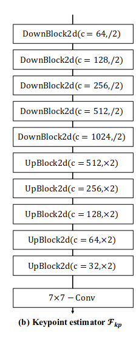
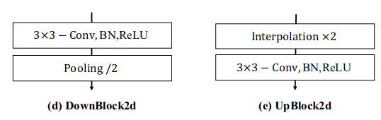
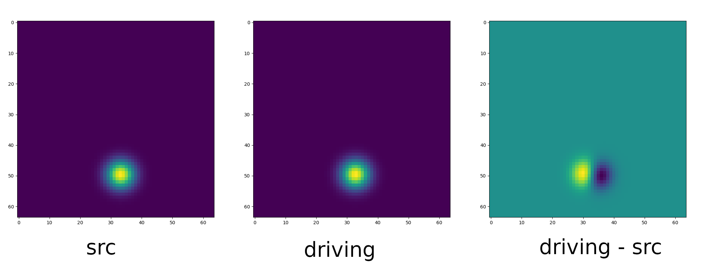

# FOMM

## keypoint detector network:
通过U-Net得到feature map




* 输入为1x3x64x64的图像, 每经过一个DownBlock wh/2, channelx2.
* 接着是一系列UpBlock, UpBlock先通过插值将whx2, 再通过conv将channel/4, 再concate上原对应层数据, 这样输出whx2, channel/2. 最终输出1x35x64x64的feature map.
* 最后通过一个7x7的conv, 输出depth=num_kpt的heat_map(热力图). 再通过softmax函数将热力图转化为该像素点是keypoint的概率值.
* 然后通过加权得到特征点的位置. (grid是一个wxhx2的array, 每个的值代表其2D坐标, 用它与概率值相乘再求和) arg-softmax, 可微分.

## Dense Motion Network

通过关键点检测, 得到driving frame上的相对运动, normalize计算相对运动, 最终计算得到source frame上关键点的目标位置.

```python
kp_norm = normalize_kp(
    kp_source=kp_source, kp_driving=kp_driving,
    kp_driving_initial=kp_driving_initial, use_relative_movement=relative,
    use_relative_jacobian=relative, adapt_movement_scale=adapt_movement_scale)
```

通过`OcclusionAwareGenerator::forward(self, source_image, kp_driving, kp_source)`计算motion.

先计算得到每keypoint运动的影响程度的高斯热力图heatmap, 距离keypoint越近影响越大, driving - source:

$$
\mathrm{H}_k = \exp(\frac{(\tau_{D \leftarrow R}(p_k) - z)^2}{\sigma}) - \exp(\frac{(\tau_{S \leftarrow R}(p_k) - z)^2}{\sigma})
$$



备注: $\tau_{D \leftarrow R}(p_k)$ 是keypoint在Source frame中的位置. $z$是S/D frame中每个像素点的位置.


### Occlusion Map

