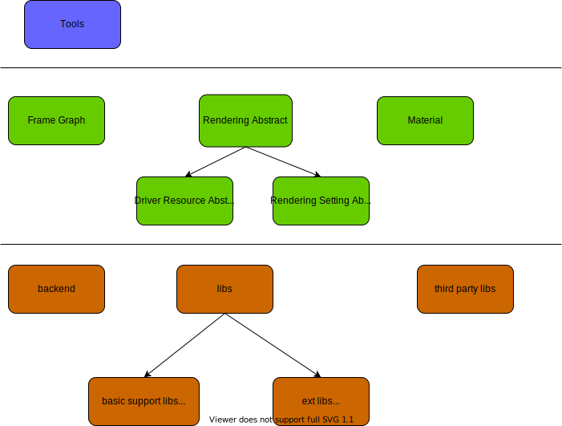
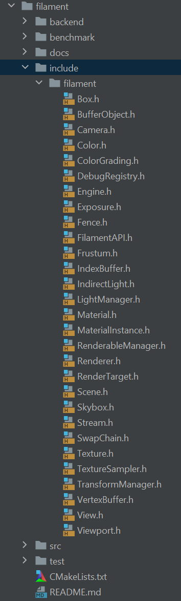
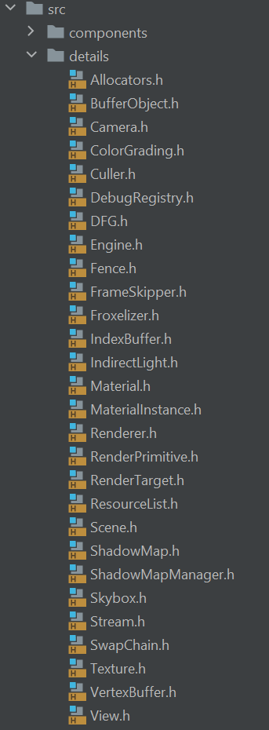

## filament 源码分析

### filament overview

filament整体架构:
<figure class="image">
<center>

</center>
<center><em>filament代码头文件</em></center>
</figure>

* Tools主要是材质或模型的处理优化工具. 比如: 材质编译工具`matc`, 材质编辑器`tungsten`(未有成熟的Release).
* Frame Graph
    渲染帧的配置
* Rendering Data Abstract
    不同层次渲染数据以及其管理的抽象.
    * Rendering API Object抽象, 例如: Texture, Buffer, SwapChain, RenderTarget
    * 其他渲染管理数据的抽象, 如: Light, LightManager, Camera, Viewport, Material ... / Scene, Engine
* Material 材质的定义和解析

### 主体库 filament

不同层次渲染数据以及其管理的抽象. 

<figure class="image">
<center>


</center>
<center><em>filament代码头文件(左), filament代码src/detail(右)</em></center>
</figure>

在filament代码中使将类的实现细节和其开放的功能接口强分离, 每一个类开放的类都有一个加前缀F的实现类. 如filament主体库中这些实现类头文件在details目录下. 通过`upcast`引用实现类的实现, 如camera类中:

```c++
void Camera::setProjection(double fovInDegrees, double aspect, double near, double far,
        Camera::Fov direction) noexcept {
    upcast(this)->setProjection(fovInDegrees, aspect, near, far, direction);
}
```

`upcast`的定义:

```c++
#define FILAMENT_UPCAST(CLASS)                                      \
    inline F##CLASS& upcast(CLASS& that) noexcept {                 \
        return static_cast<F##CLASS &>(that);                       \
    }                                                               \
    inline const F##CLASS& upcast(const CLASS& that) noexcept {     \
        return static_cast<const F##CLASS &>(that);                 \
    }                                                               \
    inline F##CLASS* upcast(CLASS* that) noexcept {                 \
        return static_cast<F##CLASS *>(that);                       \
    }                                                               \
    inline F##CLASS const* upcast(CLASS const* that) noexcept {     \
        return static_cast<F##CLASS const *>(that);                 \
    }
```


#### 细说Material

官方文档第4小节, 专门介绍, 材料的文件格式`.filament`. JSON类似文件格式, 允许c++注释+key没有双引号. 包含`material`, `vertex`, `fragment`三部分.
在写filament中, 还定义了一些额外常用的API, 如`getTime()`见文档4.5节.

一个例子:

```json
material {
    name : "Textured material",
    parameters : [ //这里表示input uniform参数
        {
           type : sampler2d,
           name : texture
        },
        {
           type : float,
           name : metallic
        },
        {
            type : float,
            name : roughness
        }
    ],
    requires : [
        uv0
    ],
    shadingModel : lit, // 光照模式
    blending : opaque // 混合模式
}

fragment {
    void material(inout MaterialInputs material) {
        prepareMaterial(material); // 初始化 4.4.1
        material.baseColor = texture(materialParams_texture, getUV0());
        material.metallic = materialParams.metallic;
        material.roughness = materialParams.roughness;
    }
}
```

`matc`工具用来编译和验证`.filament`材质文件, 输出`.mat`文件. `matc`的一些参数:

| Flag | Value | Usage |
| ---- | ---- | ---- |
| __-o, --output__ | [path] | Specify the output file path |
| __-p, --platform__ | desktop/mobile/all | Select the target platform(s) |
| __-a, --api__ | opengl/vulkan/metal/all | Specify the target graphics API |
| __-S, --optimize-size__ | N/A | 不仅做性能优化, 且做文件大小优化 |
| __-r, --reflect__ | parameters | 将参数解析出来以JSON格式打印输出 |

Material在编译之后, 其实是成为了一个二进制的键值对. 在解析时`MaterialParser`通过库`filflat`, 来解析出数据. 根据解析的数据, 构建`FMaterial`.

```c++
class FMaterial : public Material {
    FMaterial(FEngine& engine, const Material::Builder& builder); // 参数的设置
    backend::Handle<backend::HwProgram> getProgram(uint8_t variantKey) const noexcept; // shader
}
```

__Question: 对于有多个pass的material如何处理?__

### Backend

backend包括两部分:
* 图形API抽象

* 系统平台抽象

### JobSystem


### 内存管理

为什么不用c++默认的内存管理方式? $\to$ [游戏引擎开发新感觉！(6) c++17内存管理](https://zhuanlan.zhihu.com/p/96089089)

Memory Areana, 一块巨大连续的内存, 申请一次, 多次使用(CPU, GPU均有此优化的思想).

> An arena is just a large, contiguous piece of memory that you allocate once and then use to manage memory manually by handing out parts of that memory. 

```c++
#ifndef NDEBUG

// on Debug builds, HeapAllocatorArena needs LockingPolicy::Mutex because it uses a
// TrackingPolicy, which needs to be synchronized.
using HeapAllocatorArena = utils::Arena<
        utils::HeapAllocator,
        utils::LockingPolicy::Mutex,
        utils::TrackingPolicy::DebugAndHighWatermark>;

using LinearAllocatorArena = utils::Arena<
        utils::LinearAllocator,
        utils::LockingPolicy::NoLock,
        utils::TrackingPolicy::DebugAndHighWatermark>;

#else

// on Release builds, HeapAllocatorArena doesn't need a LockingPolicy because HeapAllocator is
// intrinsically synchronized as it relies on heap allocations (i.e.: malloc/free)
using HeapAllocatorArena = utils::Arena<
        utils::HeapAllocator,
        utils::LockingPolicy::NoLock>;

using LinearAllocatorArena = utils::Arena<
        utils::LinearAllocator,
        utils::LockingPolicy::NoLock>;

#endif
```

### FrameGraph


### 其他

#### 异常管理机制

#### 版本管理
Filament使用三个数字来定义一个版本:
* __most significant__ number, 当API不再向后兼容, 或者引入一套新的API.

* __middle number__, 当材质系统不再向后兼容. 此时需要对材质文件进行重新编译.
    
    另外, 在`MaterialEnums.h`文件中, 定义了`MATERIAL_VERSION`, 运行时检测材质版本是否对应, 需要同步更新.

* __least significant__, 每次Release版本更新时的版本号, 其他两个更新时重置为0.

值得借鉴的有两点:

* material 的版本管理

* material 文件定义了一个人类友好的格式(易读和理解), 在compile来转变为机器友好的格式(高效加载, 以及渲染优化).

#### 混合和半透明


## 参考资料
[filament Material]()
[游戏引擎开发新感觉！(6) c++17内存管理](https://zhuanlan.zhihu.com/p/96089089)
[《STL源码剖析》提炼总结：空间配置器(allocator)](https://zhuanlan.zhihu.com/p/34725232)