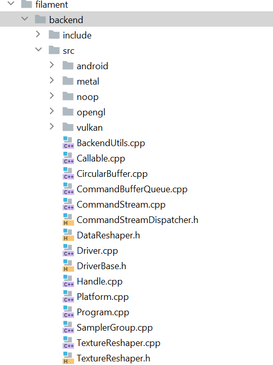
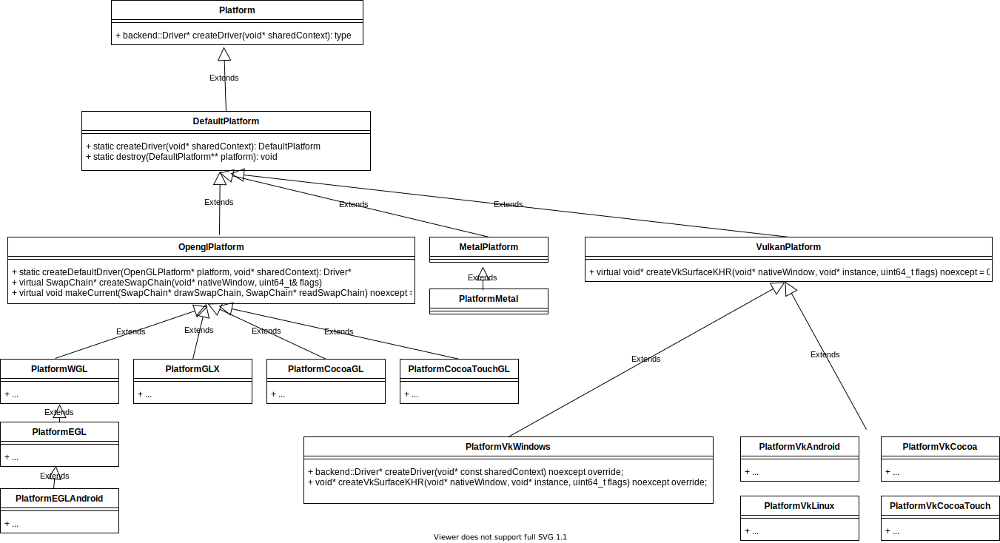

## filament 源码分析

### filament overview

filament整体架构:
<figure class="image">
<center>

</center>
<center><em>filament主要结构</em></center>
</figure>

第一层 [工具、example、App]
* Tools主要是材质或模型的处理优化工具. 比如: 材质编译工具`matc`, 材质编辑器`tungsten`(未有成熟的Release).

第二层 [用户接口]
* Engine, 虚拟渲染资源创建销毁管理, 并利用JobSystem, 发送命令到下一层.
* Virtual Rendering Resource, 虚拟渲染资源.
* 场景级别的抽象, 包括View(后处理如抗锯齿、雾等, Viewport, Camera等), Scene(场景中的物体), Entity(被绘制的物体+light等).

第三层 [支撑组件]
* Backend/RHI
    * Platform 系统和窗口的抽象
    * Rendering Resource/Setting抽象, 例如: Texture, Buffer, SwapChain, RenderTarget
    * Driver 创建销毁渲染资源
    * Context 跟踪管理渲染资源以及渲染状态设置
* Frame Graph 渲染帧图, 一帧渲染的整个pipline.
* Material 材质的定义和解析
* JobSystem 任务系统

除了此部分之外, 对于Android, 还有特定的JNI导出`android/filament-android`.

### 主体库 filament [第二层]

不同层次渲染数据以及其管理的抽象. 

<figure class="image">
<center>


</center>
<center><em>filament代码头文件(左), filament代码src/detail(右)</em></center>
</figure>

#### 细说Material

官方文档第4小节, 专门介绍, 材料的文件格式`.filament`. JSON类似文件格式, 允许c++注释+key没有双引号. 包含`material`, `vertex`, `fragment`三部分.
在写filament中, 还定义了一些额外常用的API, 如`getTime()`见文档4.5节.

一个例子:

```json
material {
    name : "Textured material",
    parameters : [ //这里表示input uniform参数
        {
           type : sampler2d,
           name : texture
        },
        {
           type : float,
           name : metallic
        },
        {
            type : float,
            name : roughness
        }
    ],
    requires : [
        uv0
    ],
    shadingModel : lit, // 光照模式
    blending : opaque // 混合模式
}

fragment {
    void material(inout MaterialInputs material) {
        prepareMaterial(material); // 初始化 4.4.1
        material.baseColor = texture(materialParams_texture, getUV0());
        material.metallic = materialParams.metallic;
        material.roughness = materialParams.roughness;
    }
}
```

`matc`工具用来编译和验证`.filament`材质文件, 输出`.mat`文件. `matc`的一些参数:

| Flag | Value | Usage |
| ---- | ---- | ---- |
| __-o, --output__ | [path] | Specify the output file path |
| __-p, --platform__ | desktop/mobile/all | Select the target platform(s) |
| __-a, --api__ | opengl/vulkan/metal/all | Specify the target graphics API |
| __-S, --optimize-size__ | N/A | 不仅做性能优化, 且做文件大小优化 |
| __-r, --reflect__ | parameters | 将参数解析出来以JSON格式打印输出 |

Material在编译之后, 其实是成为了一个二进制的键值对. 在解析时`MaterialParser`通过库`filflat`, 来解析出数据. 根据解析的数据, 构建`FMaterial`.

```c++
class FMaterial : public Material {
    FMaterial(FEngine& engine, const Material::Builder& builder); // 参数的设置
    backend::Handle<backend::HwProgram> getProgram(uint8_t variantKey) const noexcept; // shader
}
```

__TODO Question: 对于有多个pass的material如何处理?__

### Backend/RHI

backend包括两部分:

* 图形渲染API抽象
    * Engine, 用户调用接口. 生成命令提交给JobSystem.
    * Context, 上下文(图形资源、图形CommandQueue, CommandBuffer, State, SwapChain等).
    * Driver, 图形API抽象调用(创建/销毁抽象的图形资源、状态设置)
    * 资源抽象 图形资源的封装

* 平台窗口系统中间层抽象
    平台窗口系统中间抽象, 在各个platform*.*中定义和实现.    

<figure class="image">
<center>


</center>
<center><em>filament backend(left),  opengl(es) backend(right)</em></center>
</figure>

#### backend初始化过程

在filament中, `opengl context`, `vulkan/metal device`是怎么创建的?

在platform中封装了各个平台+窗口系统下, 各个图形API Driver的创建和销毁. 其中, Opengl由于其设计思想比较古老, 还添加了swapchain以及makecurrent等函数.

<figure class="image">
<center>

</center>
<center><em>platform 结构</em></center>
</figure>

几个重要的platform:
* PlatformWGL中, platform在创建的时候直接创建窗口, 并得到窗口的opengl context.

* PlatformEGLAndroid

* PlatformVkWindows, 

* PlatformVkAndroid

* platformMetal, 直接创建Device.

在创建了platform之后, 再使用OpenGLDriverFactory根据platform和context, 创建Driver.

🍉 在PC(Windows/Linux/MAC)上, vulkan/opengl虽然链接的库不同, 但其有统一的标准. filament使用bluevk, blueopengl实现运行时加载.
动态加载动态库可以得到函数名和指针, 为了在使用时无差别, 使用汇编伪指令定义了每个opengl api函数. 对于移动端(ios/android)则任然使用各自的头文件.

```c++
struct {
    void** api_call;
    const char* api_name;
} g_gl_stubs[] = {
    { &__blue_glCore_glMultiDrawArraysIndirectBindlessCountNV, "glMultiDrawArraysIndirectBindlessCountNV" },
    { &__blue_glCore_glCopyTexImage1D, "glCopyTexImage1D" },
...
};

for (unsigned int i = 0; i < blueCoreNumFunctions; i++) {
    *g_gl_stubs[i].api_call = loadFunction(g_gl_stubs[i].api_name);
    ...
}
```

```
extrn __blue_glCore_glMultiDrawArraysIndirectBindlessCountNV: qword
glMultiDrawArraysIndirectBindlessCountNV proc
    mov r11, __blue_glCore_glMultiDrawArraysIndirectBindlessCountNV
    jmp r11
glMultiDrawArraysIndirectBindlessCountNV endp
```

🥝 这个地方自动生成各个函数指针定义, 以及加载的代码是不是更通熟易懂?

#### backend资源创建过程

在filament中, 大部分操作都需要用到`Engine`, 调用其相关函数, 但仔细看代码可以发现, `Engine`类其实只是构建了虚拟的资源, 并不真正干活.

```c++
template <typename T>
inline T* FEngine::create(ResourceList<T>& list, typename T::Builder const& builder) noexcept {
    T* p = mHeapAllocator.make<T>(*this, builder);
    list.insert(p);
    return p;
}
```

#### 其他:

* 🥝 filament的RHI设计感觉有点复杂. 其中包括了系统平台的统一以及图形API的统一. 而Qt有其天然的优势: 早就统一了系统和窗口平台(此部分不用关注), 因此其RHI的设计相对独、清晰.

* filament如何编译android/ios版本? 在cmake时使用特定的toolchain. 在代码的Windows.md中有详细说明.

* 如何区分OpenGL和OpenGLES的? OpenGL和OpenGL ES函数相同, 只是库不一样.


### JobSystem

在filament中定义了一个任务系统, 所有操作都封装成了一个个的command, 丢到任务系统中异步执行.


### 🍉 内存管理

为什么不用c++默认的内存管理方式? $\to$ [游戏引擎开发新感觉！(6) c++17内存管理](https://zhuanlan.zhihu.com/p/96089089)

Memory Areana, 一块巨大连续的内存, 申请一次, 多次使用(CPU, GPU均有此优化的思想).

> An arena is just a large, contiguous piece of memory that you allocate once and then use to manage memory manually by handing out parts of that memory. 

__new operator和operator new__

new operator类似于`malloc`用来申请内存, 可以被重载. 而operator new, 除了申请内存外, 还执行类对象的构造函数.

#### 内存对齐
```c++
class FEngine : public Engine {
public:
    inline void* operator new(std::size_t count) noexcept {
        return utils::aligned_alloc(count * sizeof(FEngine), alignof(FEngine));
    }
    ...
}

inline void* aligned_alloc(size_t size, size_t align) noexcept {
    assert(align && !(align & align - 1));

    void* p = nullptr;

    // must be a power of two and >= sizeof(void*)
    while (align < sizeof(void*)) {
        align <<= 1u;
    }

#if defined(WIN32)
    p = ::_aligned_malloc(size, align);
#else
    ::posix_memalign(&p, align, size);
#endif
    return p;
}

// void* aligned_alloc( std::size_t alignment, std::size_t size ); (since C++17)
```

#### 自主管理内存
```c++
// file allocators.h
#ifndef NDEBUG

// on Debug builds, HeapAllocatorArena needs LockingPolicy::Mutex because it uses a
// TrackingPolicy, which needs to be synchronized.
using HeapAllocatorArena = utils::Arena<
        utils::HeapAllocator,
        utils::LockingPolicy::Mutex,
        utils::TrackingPolicy::DebugAndHighWatermark>;

using LinearAllocatorArena = utils::Arena<
        utils::LinearAllocator,
        utils::LockingPolicy::NoLock,
        utils::TrackingPolicy::DebugAndHighWatermark>;

#else

// on Release builds, HeapAllocatorArena doesn't need a LockingPolicy because HeapAllocator is
// intrinsically synchronized as it relies on heap allocations (i.e.: malloc/free)
using HeapAllocatorArena = utils::Arena<
        utils::HeapAllocator,
        utils::LockingPolicy::NoLock>;

using LinearAllocatorArena = utils::Arena<
        utils::LinearAllocator,
        utils::LockingPolicy::NoLock>;

#endif
```

定义了3中allocator:

* `LinearAllocator` 比如command
    * 申请的内存地址线性递增. (在初始化时申请了一大块内存buffer).
    * 类似栈的方式(内存只能从顶部开始释放), 后申请的内存要先被释放.
    
* `HeapAllocator`
    使用系统的malloc和free, 在堆上申请和释放内存.

* `PoolAllocator`.
    用来分配小于指定大小的内存块. 允许无序释放.

⚠️ allocator在释放内存时, 不执行析构函数. 如何防止内存泄漏?

Trivial destructor
The destructor for class T is trivial if all of the following is true:

* The destructor is not user-provided (meaning, it is either implicitly declared, or explicitly defined as defaulted on its first declaration)
* The destructor is not virtual (that is, the base class destructor is not virtual)
* All direct base classes have trivial destructors
* All non-static data members of class type (or array of class type) have trivial destructors

A trivial destructor is a destructor that performs no action. Objects with trivial destructors don't require a delete-expression and may be disposed of by simply deallocating their storage. All data types compatible with the C language (POD types) are trivially destructible.

在ArenaScope于析构函数不是trival destructor的类需要执行析构函数.

```c++
// std::is_trivially_destructible<T>::value
if (std::is_trivially_destructible<T>::value) {
    o = mArena.template make<T, ALIGN>(std::forward<ARGS>(args)...);
    } else {
        void* const p = (Finalizer*)mArena.alloc(sizeof(T), ALIGN, sizeof(Finalizer));
        if (p != nullptr) {
            o = new(p) T(std::forward<ARGS>(args)...);
            f->finalizer = &destruct<T>;
            f->next = mFinalizerHead;
            mFinalizerHead = f;
        }
    }
}
```

在Arena中则通过`std::enable_if`不允许申请:
```c++
template <typename T,
    typename = typename std::enable_if<std::is_trivially_destructible<T>::value>::type>
    T* alloc(size_t count, size_t alignment = alignof(T), size_t extra = 0) { ... }
```

在申请内存时, 默认使用最大的scalar的大小(`alignof`是一个POD中最大的那个内存及其大小):

```c++
void* alloc(size_t size, size_t alignment = alignof(std::max_align_t), size_t extra = 0) {
    // this allocator doesn't support 'extra'
    assert(extra == 0);
    return aligned_alloc(size, alignment);
}
```

### 🍉 FrameGraph

### 其他

#### 一些值得借鉴的写法

🍉 detail 和 implementation分离
在filament代码很多类都有一个加前缀F的实现类. 这些实现类头文件在details目录下. 通过`upcast`引用实现类的实现, 如camera类中:

```c++
void Camera::setProjection(double fovInDegrees, double aspect, double near, double far,
        Camera::Fov direction) noexcept {
    upcast(this)->setProjection(fovInDegrees, aspect, near, far, direction);
}
```

`upcast`的定义:

```c++
#define FILAMENT_UPCAST(CLASS)                                      \
    inline F##CLASS& upcast(CLASS& that) noexcept {                 \
        return static_cast<F##CLASS &>(that);                       \
    }                                                               \
    inline const F##CLASS& upcast(const CLASS& that) noexcept {     \
        return static_cast<const F##CLASS &>(that);                 \
    }                                                               \
    inline F##CLASS* upcast(CLASS* that) noexcept {                 \
        return static_cast<F##CLASS *>(that);                       \
    }                                                               \
    inline F##CLASS const* upcast(CLASS const* that) noexcept {     \
        return static_cast<F##CLASS const *>(that);                 \
    }
```

🍉 构建者模式和工厂模式


🍉 资源对象的不允许拷贝, 不允许在堆上创建

```c++
class UTILS_PUBLIC FilamentAPI {

    // disallow copy and assignment
    FilamentAPI(FilamentAPI const&) = delete;
    FilamentAPI(FilamentAPI&&) = delete;
    FilamentAPI& operator=(FilamentAPI const&) = delete;
    FilamentAPI& operator=(FilamentAPI&&) = delete;


    // allow placement-new allocation, don't use "noexcept", to avoid compiler null check
    static void *operator new     (size_t, void* p) { return p; }

    // prevent heap allocation
    static void *operator new     (size_t) = delete;
    static void *operator new[]   (size_t) = delete;
    static void  operator delete  (void*)  = delete;
    static void  operator delete[](void*)  = delete;
};
```

#### 异常管理机制

#### 🍉 版本管理
Filament使用三个数字来定义一个版本:
* __most significant__ number, 当API不再向后兼容, 或者引入一套新的API.

* __middle number__, 当材质系统不再向后兼容. 此时需要对材质文件进行重新编译.
    
    另外, 在`MaterialEnums.h`文件中, 定义了`MATERIAL_VERSION`, 运行时检测材质版本是否对应, 需要同步更新.

* __least significant__, 每次Release版本更新时的版本号, 其他两个更新时重置为0.

值得借鉴的有两点:

* material 的版本管理

* material 文件定义了一个人类友好的格式(易读和理解), 在compile来转变为机器友好的格式(高效加载, 以及渲染优化).

#### 混合和半透明


## 参考资料
[filament Material]()
[游戏引擎开发新感觉！(6) c++17内存管理](https://zhuanlan.zhihu.com/p/96089089)
[《STL源码剖析》提炼总结：空间配置器(allocator)](https://zhuanlan.zhihu.com/p/34725232)