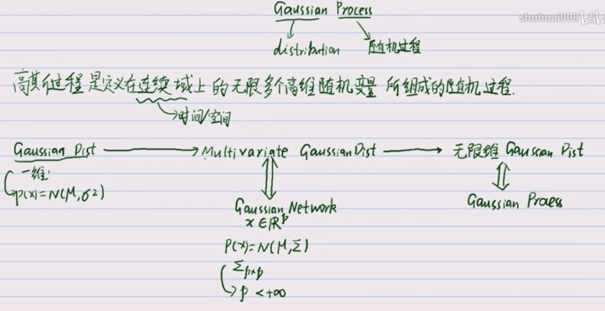
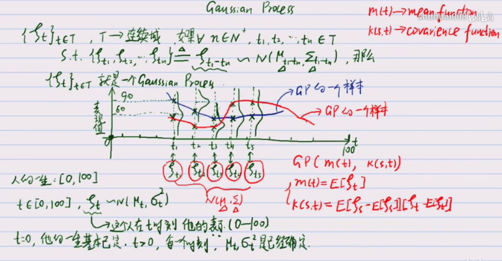
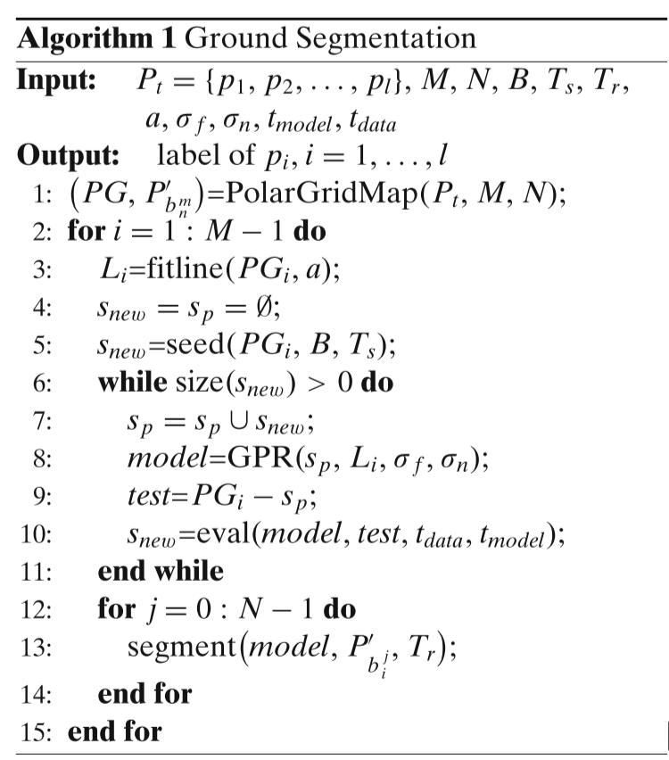

# 高斯过程
## 高斯过程的理解
扩展到无限维度, 则称为高斯过程.

每一个维度上的值都属于一个高斯分布, 不同维度之间有相互联系(通过kernel/协方差来表示). 一个数据就是此高斯过程的一次采样.

高斯过程也可以理解为插值: 
1. 对于函数$f(x)$, 每一次从不同$x$处观察$f(x)$都可以作为一个随机变量来看待, 它们都服从和一个$x$无关的高斯噪声分布.
2. 对于任意两个$x, x'$, 我们认为$x$和$x'$的距离决定了他们之间的相关性.

从而, 例如 $x=1, 2, 3$ 均得到了数据, 那么我们要推测$x=4$处的数据分布, 就可以通过它和前三个数据的相关性, 来找到一个合理的bound.

## 高斯过程回归理论
定义：高斯过程是指随机变量的一个集合, 其中任意有限个样本的线性组合都有一个联合高斯分布.
一个高斯过程是由均值函数$m(x)$和协方差函数$k(x, x^*)$确定. 有如下公式:
$$
f \sim \mathcal{GP}(m,k)
$$
高斯过程将多元高斯分布扩展到无限维度. 任意数据中n个观测量, $y=y_1, ..., y_n$ 都可以理解成从某个多元高斯分布中抽取的一个样本. 通常, 我们将高斯过程的均值设置为`0`(这里为什么是0, 我也不解, 要理解这个估计需要深挖, 可以参看《Gaussian Process for Machine Learning》), 协方差最常用的选择是"平方指数(squared exponential)":
$$
k(x_i, x_j) = \sigma_f^2 \exp[\frac{-(x_i-x_j)^2}{2l^2}]
$$
这里$\sigma_f, l$叫做`hyper-parameters`. 由于噪音的存在, 把模型建立成如下形式:
$$
\left.
\begin{aligned}
y &= f(x) + N(0, \sigma_n^2) \\
\mathbf{K}(x_i, x_j) &= k(x_i, x_j) + \sigma_n^2 \delta_{ij}
\end{aligned}
\right\} \Rightarrow y \sim N(0, K)
$$
其中: $\delta_{ij}$ 是Kronecker delta函数(当$i=j$时为1, 否则为0), $\sigma_n^2$是噪音的方差. 
高斯过程回归GPR,  即对于新的观测自变量$x^*$, 我们根据之前的数据$\{X, Y\}$来预测该自变量的输出值:$y^*$. 我们先对联合分布建模:
$$
\begin{bmatrix}
f(x^*)\\
\mathbf{y}
\end{bmatrix} \sim \mathcal{N}\left(\mathbf{0}, \begin{bmatrix}
k(x^*,x^*) & k(x^*,\mathbf{x})\\
k(\mathbf{x},x^*) & \mathbf{K}
\end{bmatrix}
 \right).
$$
从而可以得到:
$$
f(x^*) | \mathbf{y} \sim \mathcal{N}\left(k(x^*,\mathbf{x})\mathbf{K}^{-1}\mathbf{y}, \quad k(x^*,x^*) - k(x^*,\mathbf{x})\mathbf{K}^{-1}k(\mathbf{x},x^*)  \right).
$$
即, 其均值$\bar{y^*} = k(x^*,\mathbf{x})\mathbf{K}^{-1}\mathbf{y}$, 而其方差$V(y^*) = k(x^*,x^*) - k(x^*,\mathbf{x})\mathbf{K}^{-1}k(\mathbf{x},x^*)$.

到现在为止, 我们假设`hyper-parameters`和$\sigma_n^2$已知, 但在现实应用中并不能预先知道这些参数. 一般需要事先通过训练——优化`negative log marginal likelihood`得到. 给定一个训练集合$\Im=\{x, y\}$, 在样本集合上最小化如下能量, 求解这几个未知量.
$$
\mathcal{NLML}(\theta) = \frac12 \mathbf{y}^T \mathbf{K}^{-1} \mathbf{y} + \frac12 \log |\mathbf{K}| + \frac{N}{2} \log(2 \pi)
$$

## 一个具体的例子
### 算法介绍
这里简单介绍: [利用高斯过程分离地面](http://www.massey.ac.nz/~rwang/publications/13-JINT-Chen.pdf), 该论文中的高斯过程的使用. 我们知道, 对于平坦的地面`length-scal`$l$应该取较大值, 而对于粗糙的地面则该取较小值, 在该论文中, 为了提高分类的精度, 对于每个扇区(扇形区域)使用非静态的, 各向同性的协方差函数:
$$
k(r_i, r_j) = \sigma_f^2(l_i^2)^{\frac{1}{4}}(l_j^2)^{\frac{1}{4}}(\frac{l_i^2 + l_j^2}{2})^{-\frac{1}{2}} \times \exp(-\frac{2(r_i - r_j)^2}{l_i^2 + l_j^2})
$$
为每一个$r_i$, 都计算一个单独的$l_i$. 论文中采用INSAC(Incremental Sample Consensus)的方式迭代地进行高斯过程, 从而区分地面点和外点. 算法流程如下:

这里, M是扇区的数量, N是每个扇区bin的数量, $PG_i$是代表扇区, $P_{b_n^m}'$代表扇区中的bin, 在激光范围$B$内高度不低于$T_s$的点作为种子点. 在判断时, 认为每个bin中地面的高度是不变的(取一个均值), 与地面高度差超过阈值$T_r$的点认为是障碍物点, 否则认为是地面点. 这里不作详细的解释, 详细信息参看论文《Gaussian-Process-Based Real-Time Ground Segmentation for Autonomous Land Vehicles》.
### 代码实现
在wavelib的实现中, 并没有为每一个$r_i$单独计算$l_i$, 而是将$l$作为一个输入参数. 当然, `hyper-parameters`和$\sigma_n^2$, 也作为输入参数. 该代码基本实现该算法, 其中的INSAC(Incremental Sample Consensus)值得借鉴.

## reference
通俗易懂地介绍Gaussian Process: https://www.zhihu.com/question/46631426
高斯过程的基本原理: https://www.bilibili.com/video/av35626047/
机器学习中的高斯过程: https://www.datalearner.com/blog/1051459170229238
Gaussian Process 理论: http://www.dam.brown.edu/people/mraissi/teaching/2_gaussian_processes_tutorial/
Matlab GP example 代码: https://github.com/maziarraissi/TutorialGP
GP Ground Segmentation: http://www.massey.ac.nz/~rwang/publications/13-JINT-Chen.pdf
GP Ground Segmentation Code Wavelib: https://github.com/wavelab/libwave/tree/master/wave_matching/include/wave/matching
