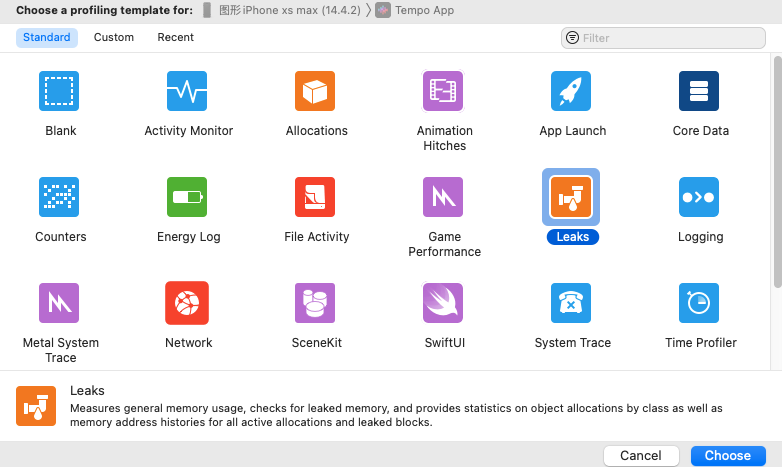
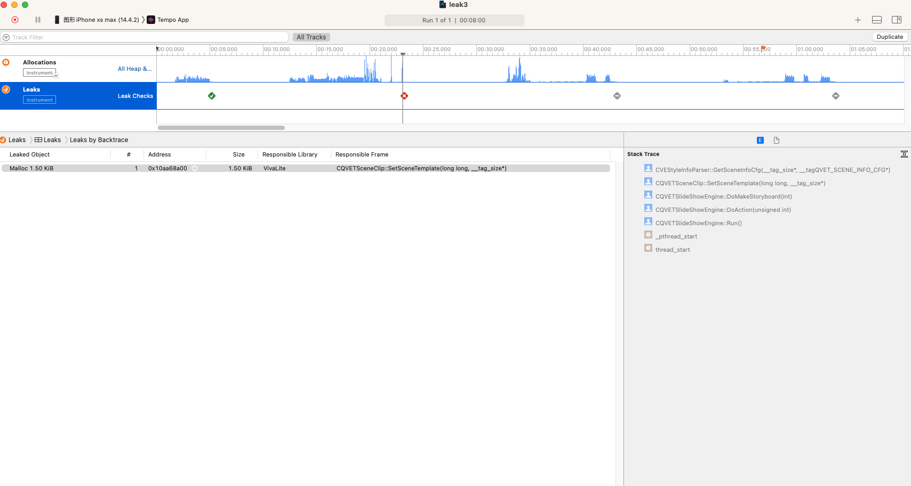
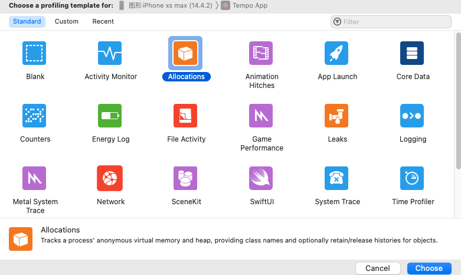
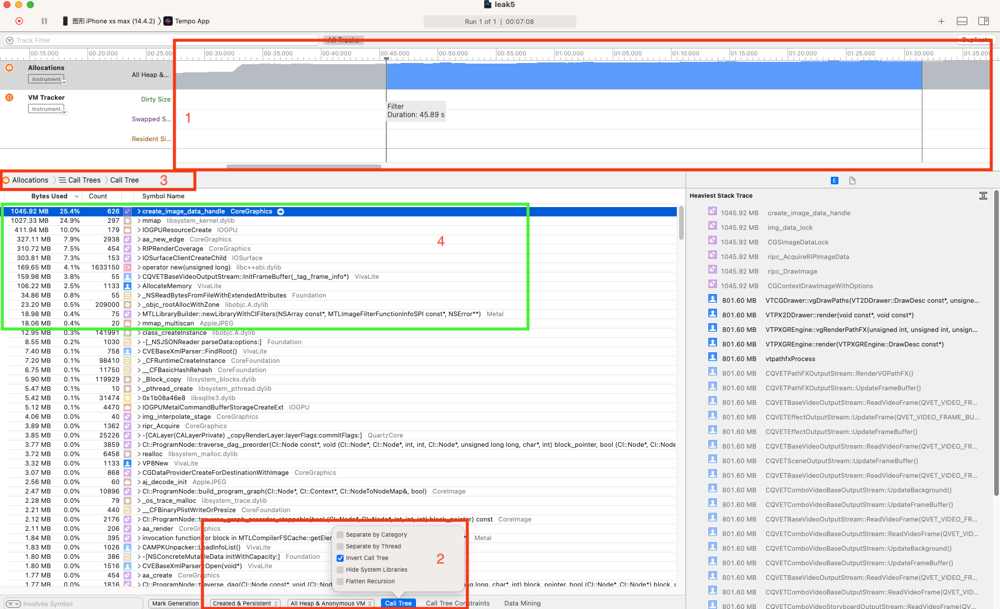

## 内存检测工具使用
### XCode Instrument
#### 内存泄漏检测
检测那些申请且已经失去引用, 但没有释放的内存.
启动内存泄漏检测: `Product` $\to$ `Profile` $\to$ `leaks`.

点击左上角按钮🔘运行程序后, 可以看到 ✅ 表示没有内存泄漏, ❌ 表示有新的内存泄漏, 点击它, 可以看到具体的泄漏代码位置. 

#### 检测不断申请且持有的内存.
除了不同的内存泄漏, 我们在写代码的时候仍然有可能有不断申请内存且持有引用, 导致内存不断上涨的情况. __此时, 我们可以关注当程序运行起来之后, 我们认为内存应该稳定的一段时间区域内, 不正常的内存的申请和持有情况.__

`Product` $\to$ `Profile` $\to$ `Allocations`.

同样将程序运行起来, 然后我们可以在区域1中选择一段时间区域. 为了方便查找内存申请的位置, 建议在3中选择`calltree`, 在区域2中选择`created&persistent`(创建且持有), `invert call tree`更方便查找内存申请的源头.

从上图区域4我们可以看到, 在这段时间区域内所申请且持有的内存.

### Visual studio