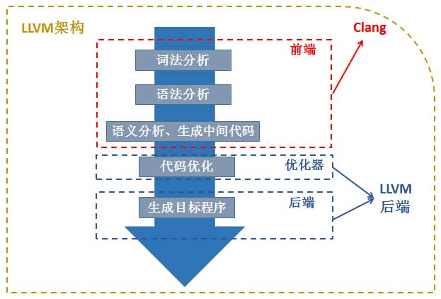

## Clang
编译器粗略分为
前端: 词法分析、语法分析、类型检查、中间代码生成.
后端: 代码优化、目标代码生成、目标代码优化.
<figure class="image">

<em>Clang-llvm编译器</em>

</figure>

## Reference
[clang历史 refere to article GCC_LLVM_Clang]()
[clang](https://clang.llvm.org/docs/CommandGuide/clang.html)