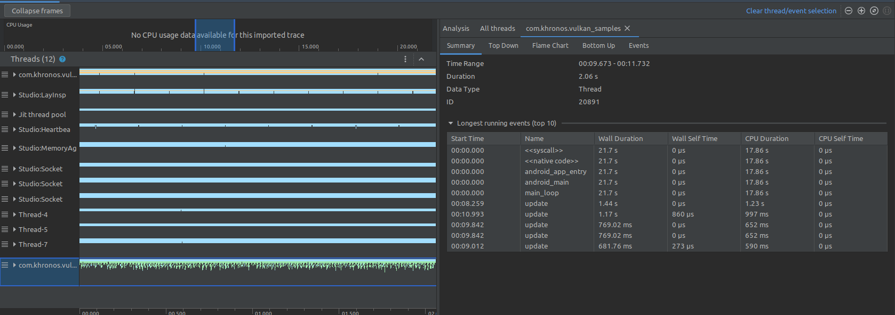
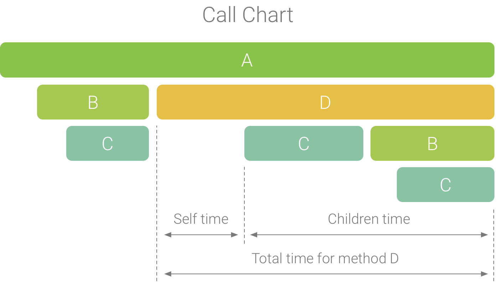
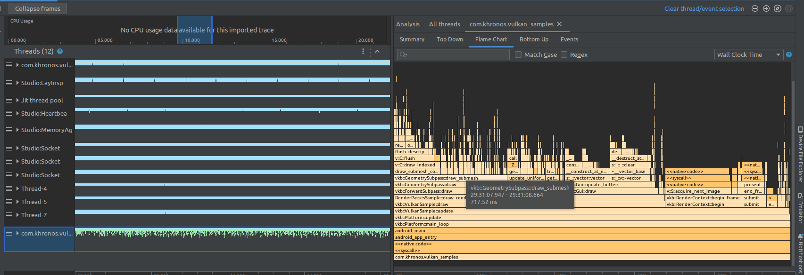

# Performance Profile
## Android-Studio CPU Profile

在record之后, 可以通过点击线程的名字, 来选择展示特定线程/或多个线程(shift选取)的Summary, Top Down, Flame Char, Bottom Up 和 Events. 
 
在CPU Usage中可以选取时间段(对Events无效).

### Summary
显示汇总信息, 时间跨度, 时间间隔, 以及运行时间最长的10个event.

### Top Down & Bottom Up
线程耗时堆栈.

### Flame Chat
火焰图提供一个倒置的图表, 来汇总展示线程的调用堆栈和时间消耗. 
火焰图中, 会将具有相同调用堆栈的函数汇总起来, 因此 __横坐标不代表时间轴, 而是执行每个函数的相对时间__.
火焰图中, 不同的属性的函数以不同的颜色表示: __橙色表示系统库函数, 绿色表示APP的函数, 蓝色表示第三方库函数__.

### Event

### System Trace
System Trace 需要在调试手机上开启之后才能收集.

## Reference
[Android CPU Studio Profile Activity](https://developer.android.com/studio/profile/inspect-traces?hl=en)
[Android CPU Capture a system trace on a device](https://developer.android.com/topic/performance/tracing/on-device?hl=en)
[Android CPU system trace report](https://developer.android.com/topic/performance/tracing/navigate-report?hl=en#analysis)