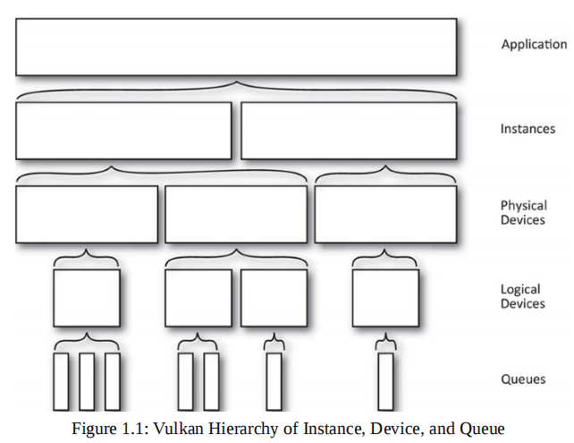

## Vulkan
《Vulkan Programming Guide》 的一些笔记.

### 一些核心概念
<figure class="image">
  
</figure>

* Physical Device (物理设备)
    Physical Device表示系统的硬件.
    >Physical devices are normally parts of the system—a graphics card, accelerator, DSP, or other component.

    ```c++
    // create
    uint32_t gpuCount = 0;
	vkEnumeratePhysicalDevices(instance, &gpuCount, nullptr);
    vkEnumeratePhysicalDevices(instance, &gpuCount, devices.data());

    // physical device properties
    // 硬件的属性: 硬件的名称, 制造商, 驱动版本
    vkGetPhysicalDeviceProperties(devices[j], &deviceProperties);

    // physical device features
    // 一大堆bool值来表示那些特性被支持, 例如geometry/tessellation shader, textureCompress 
    vkGetPhysicalDeviceFeatures(physicalDevice, &deviceFeatures);

    // physical device extension
    /*
     Vulkan extensions are simply additional features that Vulkan implementations may
     provide if they so choose to. They add new functions, structs, and valid 
     enumerators to the API, and they can change some of the behavior of existing 
     functions.
    */
    uint32_t extCount = 0;
    vkEnumerateDeviceExtensionProperties(physicalDevice, nullptr, &extCount, nullptr);
    std::vector<VkExtensionProperties> extensions(extCount);
    vkEnumerateDeviceExtensionProperties(physicalDevice, nullptr, &extCount, &extensions.front());
    ```
* Device Queues
    <figure class="image">
        
    </figure>

    所有的操作都需要通过队列提交给硬件, 然后才能被执行.
    >A queue is the abstracted mechanism used to submit commands to the hardware.
    >A queue family is a group of queues that have identical capabilities but are able to run in parallel.
    ```c++
    // 获取所有queue family的信息
    uint32_t queueFamilyCount;
	vkGetPhysicalDeviceQueueFamilyProperties(physicalDevice, &queueFamilyCount, nullptr);
    queueFamilyProperties.resize(queueFamilyCount);
	vkGetPhysicalDeviceQueueFamilyProperties(physicalDevice,
        &queueFamilyCount, queueFamilyProperties.data());

    // 而后, 将所需要的queue设置到Logical Device的创建信息中
    VkDeviceCreateInfo deviceCreateInfo = {};
    ...
    deviceCreateInfo.queueCreateInfoCount = static_cast<uint32_t>(queueCreateInfos.size());;
    deviceCreateInfo.pQueueCreateInfos = queueCreateInfos.data();
    ...
    ```
* Logical Device (逻辑设备)
    Logical device对系统硬件的一种软件抽象. 真正操作的对象, 一个硬件设备可以对应多个逻辑设备.
    >Logical device is a software abstraction of a physical device, configured in a way that is specified by the application.
    
    ```c++
    VkResult result = vkCreateDevice(physicalDevice, &deviceCreateInfo, nullptr, &logicalDevice);
    ```
* Layer

* Command

* Memory & Resource Data
    内存分为: host memory, device memory.
    Vulkan包含两种基本类型的数据: Buffer、VkImage.
    * Buffer比较简单, 不包含内容的格式等信息
        *refer to book p72, triangle.cpp*
        ```c++
        VkBufferCreateInfo bufferInfo = {};
        bufferInfo.sType = VK_STRUCTURE_TYPE_BUFFER_CREATE_INFO;
        bufferInfo.size = sizeof(uboVS);
        // This buffer will be used as a uniform buffer
        // others like VK_BUFFER_USAGE_VERTEX_BUFFER_BIT ...
        bufferInfo.usage = VK_BUFFER_USAGE_UNIFORM_BUFFER_BIT;
        // 如果设置为VK_SHARING_MODE_CONCURRENT(并行), 则需要设置该buffer会被哪些queue同时使用. 参考书 p74
        bufferInfo.sharingMode = VK_SHARING_MODE_EXCLUSIVE;

        // Create a new buffer
        VK_CHECK_RESULT(vkCreateBuffer(device, &bufferInfo, nullptr, &uniformBufferVS.buffer));
        ```
    
    * Images, 相对复杂包数据类型以及内存排布等信息
        *refer to book p85, texture.cpp*
        不难发现, vulkan对内存管理提供了更精细的接口.
        ```c++
        VkImageCreateInfo imageCreateInfo = vks::initializers::imageCreateInfo();
        imageCreateInfo.imageType = VK_IMAGE_TYPE_2D;
        imageCreateInfo.format = VK_FORMAT_R8G8B8A8_UNORM;
        imageCreateInfo.mipLevels = texture.mipLevels;
        imageCreateInfo.arrayLayers = 1;
        imageCreateInfo.samples = VK_SAMPLE_COUNT_1_BIT; // 当作为attachment输出时, 可以设置多重采样
        imageCreateInfo.tiling = VK_IMAGE_TILING_OPTIMAL;
        imageCreateInfo.sharingMode = VK_SHARING_MODE_EXCLUSIVE;
        // Set initial layout of the image to undefined
        /* layout 表示该image的设计意图, 有:
            VK_IMAGE_LAYOUT_UNDEFINED (在使用之前必须转换为其他layout, 
                在创建时必须使用它或VK_IMAGE_LAYOUT_PREINITIALIZED)
            VK_IMAGE_LAYOUT_GENERAL (几乎任意使用)   
            VK_IMAGE_LAYOUT_COLOR_ATTACHMENT_OPTIMAL (作为绘制颜色输出)
            ...
        */
        imageCreateInfo.initialLayout = VK_IMAGE_LAYOUT_UNDEFINED;
        imageCreateInfo.extent = { texture.width, texture.height, 1 };
        /* usage 表示将会被用来做什么
            VK_IMAGE_USAGE_TRANSIENT_ATTACHMENT_BIT (用来保存中间结果)
            VK_IMAGE_USAGE_INPUT_ATTACHMENT_BIT (只能被fragment shader使用, 且只能访问该fragment对应的像素值)
        */
        imageCreateInfo.usage = VK_IMAGE_USAGE_TRANSFER_DST_BIT | VK_IMAGE_USAGE_SAMPLED_BIT;
        VK_CHECK_RESULT(vkCreateImage(device, &imageCreateInfo, nullptr, &texture.image));        
        ```

## Reference
[khronos vulkan official site](https://www.khronos.org/vulkan/)
[lunarg vulkan site](https://vulkan.lunarg.com/doc/sdk/1.2.162.1/windows/tutorial/html/index.html)