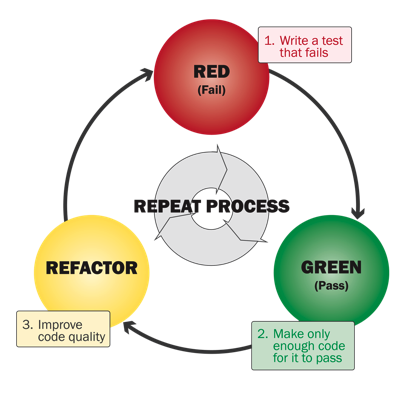

## 测试驱动开发
提前加入测试, 尽可能保证代码的正确性, 稳步推进, 合理计划——此所谓可控.
>测试驱动开发,英文全称Test-Driven Development,简称TDD,是一种不同于传统软件开发流程的新型的开发方法。它要求在编写某个功能的代码之前先编写测试代码,然后只编写使测试通过的功能代码,通过测试来推动整个开发的进行。这有助于编写简洁可用和高质量的代码,并加速开发过程。

Pipeline: 先写测试 -> 然后运行测试,测试失败 -> 让测试通过 -> 重构.

## 单元测试小结
### 理论小结

参考: https://www.zhihu.com/question/27313846/answer/130954707

单元测试的级别:
>1. Level1：正常流程可用，即一个函数在输入正确的参数时，会有正确的输出
>2. Level2：异常流程可抛出逻辑异常，即输入参数有误时，不能抛出系统异常，而是用自己定义的逻辑异常通知上层调用代码其错误之处
>3. Level3：极端情况和边界数据可用，对输入参数的边界情况也要单独测试，确保输出是正确有效的
>4. Level4：所有分支、循环的逻辑走通，不能有任何流程是测试不到的
>5. Level5：输出数据的所有字段验证，对有复杂数据结构的输出，确保每个字段都是正确的

>最理想的情况下,应该尽量多写测试用例,以保证代码功能的正确性符合预期,具有良好的容错性. 如果代码较复杂,条件分支较多,测试用例最好能覆盖所有的分支路径.

将不同的函数拆解分类再测试:
* `纯函数`对应的是数学里函数的概念,输出和输入是一一对应的.对一个输入有确定的输出. `normal judge`
* `副作用函数`同样的输入, 在不同时间和环境里, 可能有不同的输出. `special judge`

测试最痛苦的一环——数据的构造. 尽可能自己造数据, 这样更加可控.

### GTest 单元测试框架
Test Case
Test Suit
Test 