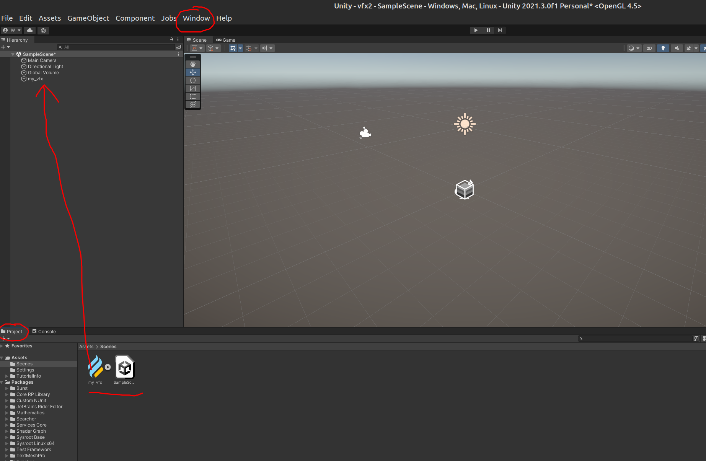
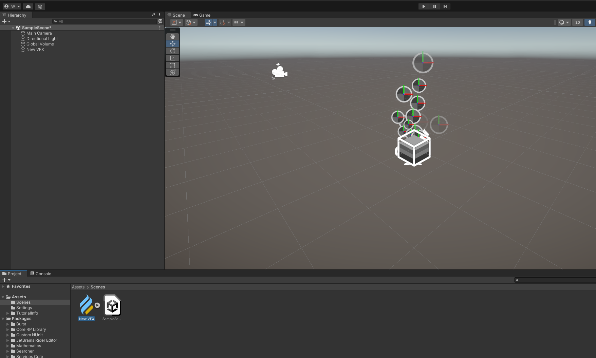
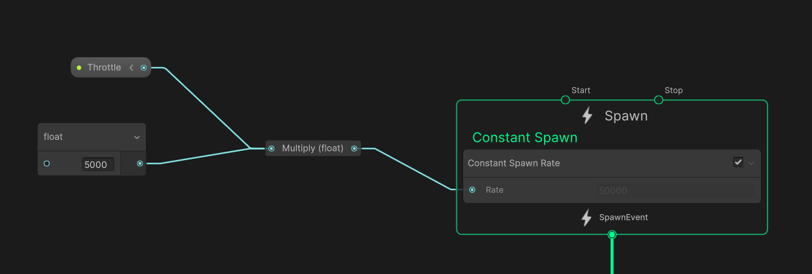
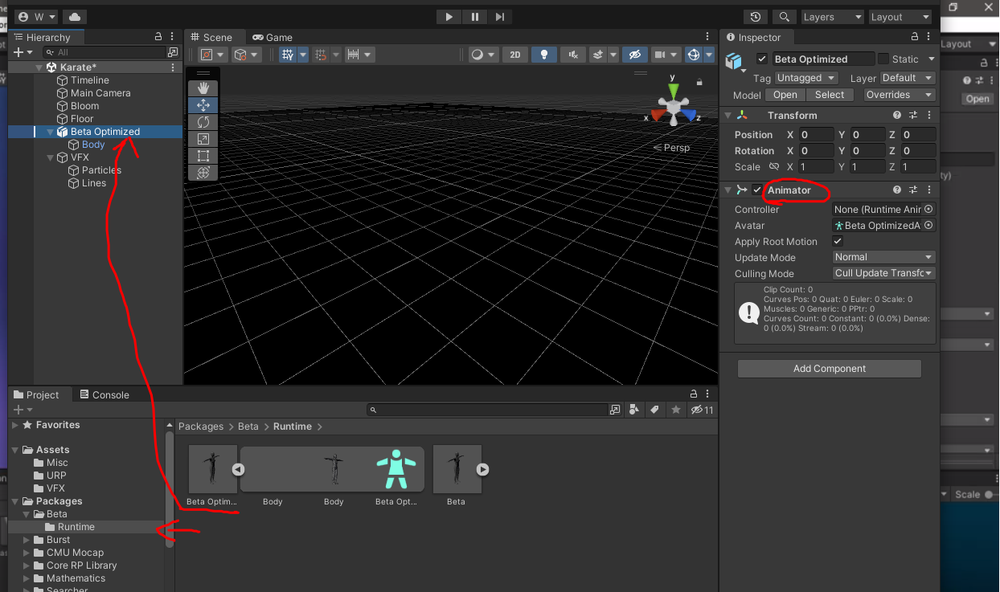
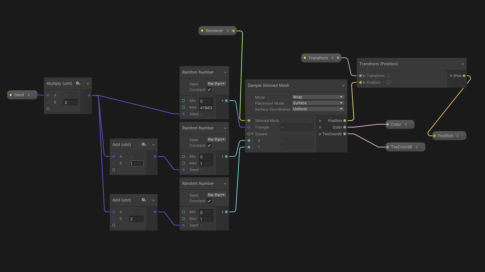
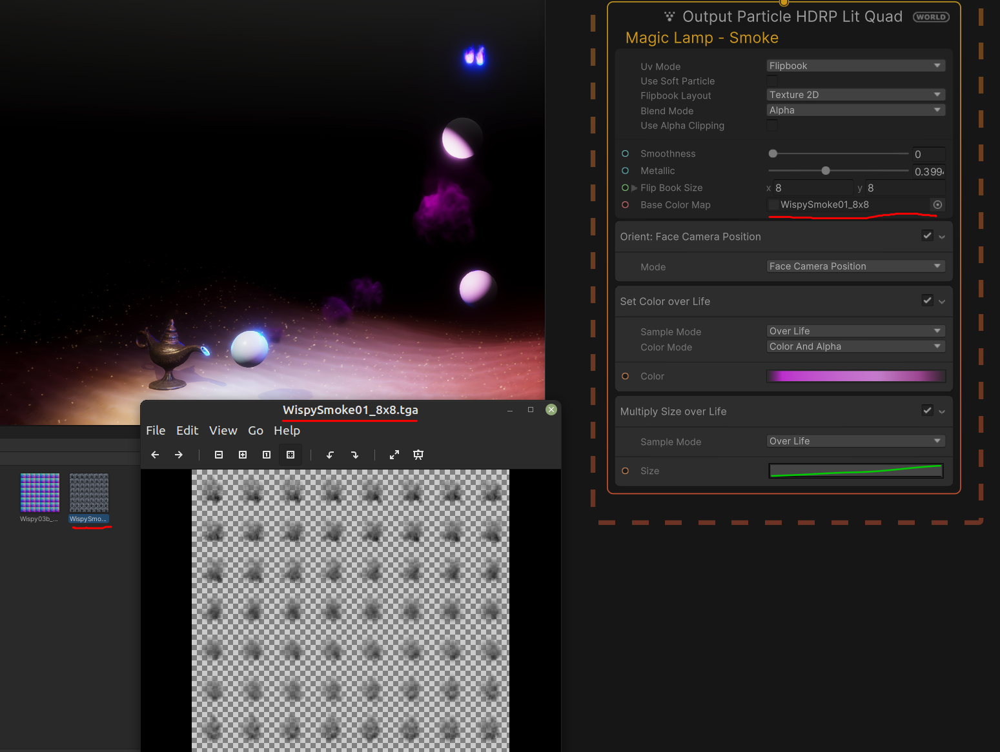

# Unity Visual Effect Graph

## Visual Effect Graph创建
1. 新建3D URP Project
    URP (Universal Render Pipleline) 通用管线流程, 轻量级渲染管线, 专注于性能.
    HDRP(High Definition Render Pipleline)高清管线流程, 专注于高端图形渲染, 针对高端硬件配置, 像PC、XBox 和Playstation，其面向高逼真度的游戏、图形demo和建筑渲染、超写实效果，以及所需的最佳图形效果.
    只有这两种支持Visual Effect Graph

2. 打开`window`->`Package Manager`, 选择`Unity Registry`, 安装`visual effect graph`.

3. 在`project`窗口下的scene中创建vfx. `create`->`visual effect`->`visual effect graph`. 然后将vfx拖入到Hierarchy窗口中.


4. VFX无法正常显示(unity bug?)
    https://issuetracker.unity3d.com/issues/vfx-opengles3-error-when-compiling-shaders-unexpected-token-number-at-kernel-csmain
    >For now this bug can be fixed by going to:
    >C:\Program Files\Unity\Hub\Editor\2022.1.0b6\Editor\Data\Resources\PackageManager\BuiltInPackages\com.unity.visualeffectgraph\Shaders\VFXCommon.hlsl
    >
    >Then go and change CUBEARRAY to 0 instead of 1.
    >#ifdef SHADER_STAGE_COMPUTE
    >#define SHADER_AVAILABLE_CUBEARRAY 0
    >#endif

    >I still have this in (at the time of writing newest version (2022.1.0b6)
    >Also in 2022.1.0b4.
    >It prevents building for Android.
    >No build is necessary to observe the issue.
    >The issue is in: VFXCommon.hlsl line: 136

    修改完成后, 重新创建项目, VFX可以正常显示.
    

5. 双击VFX Assets, `visual effect graph`窗口, 可供设计粒子效果.
    

## VFX的设计
整个系统可分为横向和纵向两种逻辑:
* 纵向逻辑
    定义了visual effect的不同处理阶段, 每个阶段封装成了一个大的容器(如图中的`Spawn`、`Initialize`...)称之为`Contexts`. 大容器内可以添加多种不同的元素称之为`Blocks`(在不同的`Contexts`中能添加的`Blocks`不同). `Blocks`可以认为是对该`Contexts`中特定属性的操作, 多个`Blocks`之间按从上到下顺序执行.

* 横向逻辑
    通过横向逻辑(从左往右), 可以加入自定义数学计算与`Blocks`的Property Slots相连, 从而自定义visual effect行为(幻化).
    


### 重要的概念

常用的`Contexts`:

* Spawn. If active, Unity calls this every Frame, and computes the amount of particles to spawn.

* Initialize. Unity calls this at the “birth” of every particle, This defines the initial state of the particle.

* Update. Unity calls this every frame for all particles, and uses this to perform simulations, for example Forces and Collisions.

* Output. Unity calls this every frame for every particle. This determines the shape of a particle, and performs pre-render transformations

三种`Systems`:
* A Spawn System consists of a single Spawn Context.
* A Particle System consists of a succession of an Initialize, then Update, then Output context.
* A Mesh Output System consists of a single Mesh Output Context.

`Blocks` `Context`中的操作, 定义了`Context`的行为, 通过它来更新`Context`的属性. 例如, 可以通过它来给粒子加一个力.

`Operators` 低级逻辑原语. 如Random, getAttribute, 颜色空间转换等等.


## 实例分析
### SMR-VFX
github地址: https://github.com/keijiro/Smrvfx

思考, 可能的实现方式: 在skined mesh表面沿着法向发射粒子, 粒子的速度与mesh上点的运动速度一致. 粒子经过一段时间后消失.


* 粒子发射
    这里, Rate指的是没秒钟发射的粒子数量. `Throttle`可以看做是UI滑动条吧.
    

* 粒子初始化
    根据skined mesh初始化粒子的相关属性.
    

    在Smrvfx中, avata的animation已被打包成一个package:
    
    
    source、sourceTransform是在particle effect的面板中设置的:
    

    这里`Transformed SMR`是一个子图:
    
    这里最核心的是`Sample Skinned Mesh`——[Sample Mesh](https://docs.unity3d.com/Packages/com.unity.visualeffectgraph@14.0/manual/Operator-SampleMesh.html)节点(通过它来得到采样点信息: position、normal、texcoord...):

    ```c++
    // the code maybe like this
    class SampleMesh
    {
        public:
        vec3 getNormal(size_t index) { return normals[index%capacity];/* for wrap mode */ }
        ...
    }
    ```
    另外, `Render`节点是


__总结__:

### Simple-vfx

### Genine

关键词: 烟雾模拟




## Reference
最基础的simple vfx解析(球体表面+perl ling noise field控制粒子速度, 根据粒子速度得到朝向和颜色): https://www.youtube.com/watch?v=FvZNVQuLDjI
根据人物模型表面发射粒子: https://www.youtube.com/watch?v=ePbeaYuMNK4

官方粒子系统的解析: 
    https://docs.unity3d.com/Packages/com.unity.visualeffectgraph@10.2/manual/index.html
    all in 推广blog: https://blog.unity.com/technology/creating-explosive-visuals-with-the-visual-effect-graph
比较好的解释的blog: https://iamsleepingnow.github.io/2021/03/03/Unity/Unity%E5%A4%A9%E5%9D%91VFX/
更多VFX教程: https://www.youtube.com/watch?v=ePbeaYuMNK4