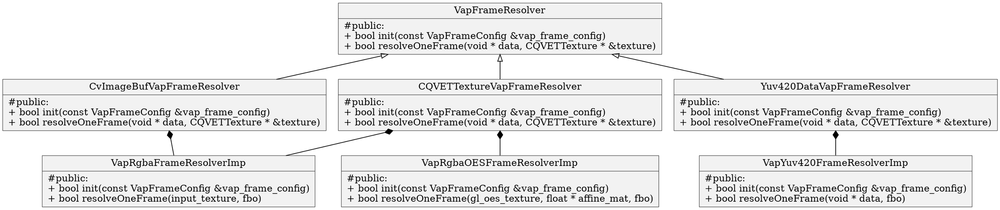
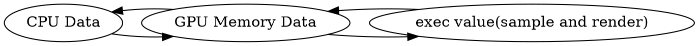

## VAP With Kiwi

### 对外接口支持 

* iOS
  *  CVPixelBufferRef, RGBA 
  * texture(opengl es, metal).  RGBA
* Android
  * texture(opengl es) RGBA
  * OES RGBA
* win32
  *  yuv420 cpu data


底层分为两个类, 实现VAP的绘制:



### ces_adk wrapper 
将ces_adk对象转换为kiwi对象, 转换后的对象不具有资源的所有权, 不负责资源的释放.
```c++
#include <kiwi/backend/kiwi_backend_wrapper.h>

#include <mvlib/mv2comdef.h>
#include <RenderEngine/etglcontext.h>
#include <RenderEngine/etgltextureutils.h>

// driver 和 command queue
// 再通过driver创建的资源具有资源的所有权, 需要负责资源的释放
#if TARGET_OS_IPHONE
        if (ctx->IsMetalAPI()) {
            auto metal_ctx = reinterpret_cast<CQVETMetalContext *>(ctx);
            driver_ = kiwi::backend::wrapMetalDriver(metal_ctx->GetDevice());
            cmd_queue_ = kiwi::backend::wrapMetalCommandQueue(driver_, metal_ctx->GetCommandQueue());
        } else if (ctx->IsOpenGLESAPI()) {
            driver_ = kiwi::backend::wrapGLDriver([ctx]() { ctx->UseCurrentContext(); }, ctx->GetEAGLContext());
            cmd_queue_ = wrapGLCommandQueue(driver_);
        }
#else
        if (ctx->IsOpenGLESAPI()) {
            driver_ = kiwi::backend::wrapGLDriver([ctx]() { ctx->UseCurrentContext(); }, nullptr);
            cmd_queue_ = wrapGLCommandQueue(driver_);
        }
#endif

// 纹理和frame buffer
#if TARGET_OS_IPHONE
        if (ctx_->IsMetalAPI()) {
            in_rhi_tex = wrapMetalTexture(driver_, CQVETGLTextureUtils::GetMetalTexture(input_tex));
            rhi_fbo = wrapMetalFrameBuffer(driver_, CQVETGLTextureUtils::GetMetalRenderPassDesc(out_texture));
        } else
#endif
        if (ctx_->IsOpenGLESAPI()) {
            in_rhi_tex = kiwi::backend::wrapGLTexture(driver_, input_tex->GetTextureName(), false);
            rhi_fbo = wrapGLFrameBuffer(driver_, out_texture->GetTextureFBO(), false);
        }
```

### OpenGL es环境适配

* Android
  参考: https://github.com/android/ndk-samples/tree/master/gles3jni
  wrapGLDriver时加载es3.0的函数
  
* iOS
  直接include header
* win32
  直接include header

### RGBA和BGRA纹理

纹理数据流可分为如下几个状态:


tq1(metal): bgra 纹理 (1,0,0,1), 采样color.xyzw值是? 蓝色(0,1,0,1)
tq2(metal): brga frame buffer, 存储 color=(1,0,0,1), 得到的图片颜色是? 红色(1,0,0,1)

所谓的RGBA与BGRA指的应该是`GPU Memory Data`的数据格式. `exec value`与`GPU Memory Data`数据交换时, 会根据颜色格式调整.

因此, 使用将输入纹理格式从BGRA改为RGBA, 将输出FBO从BGRA改为RGBA, 只需要保证纹理数据正确, 代码可以正常适配.

### 过程中遇到的问题

1. OpenGL / OpenGL es选择问题
  kiwi原实现中, 创建后的Driver无法区分OpenGL与OpenGL es. 因此compile shader时无法选取合适的shader code.
  在DriverConfig中加入了ShaderSourceType, wrapGLDriver使用OpenGL es.

2. OpenGL backend texture 纹理格式支持不全问题
  与metal不同, OpenGL将纹理格式分为 internal format(内部存储格式), format(外部传入component形式), data type(外部传入数据component数据类型)
  补全了支持
3. 粗心小错误
  在创建y,u,v纹理时, 由于相似性, 复制代码后, 未全面修改.

总结:
大部分问题出在c++代码上, 纹理等数据是否正常上传是一个关键问题. 顺序如下:
1. shader能够正常运行. 用最简单的code, 如输出红色.
2. 将输出固定颜色改为, 采样纹理颜色. check 纹理颜色是否正常.
  基本上这步错误的概率最大, 主要check两点: 纹理创建是否正常(internal format, format, data type, width, height), 纹理上传是否正常(数据源是否正常, 上传时的参数是否正确)
3. check shader code compute是否正确.

待改进之处:
1. shader代码在调试时无法正常阅读, 改为string.
2. opengl编译后, 不会用到的资源会被自动剔除, 但不方便调试. 剔除后对结果是否无影响, 但是绑定时可能会出现异常. 需要妥善处理, 以保证调试的方便性!

