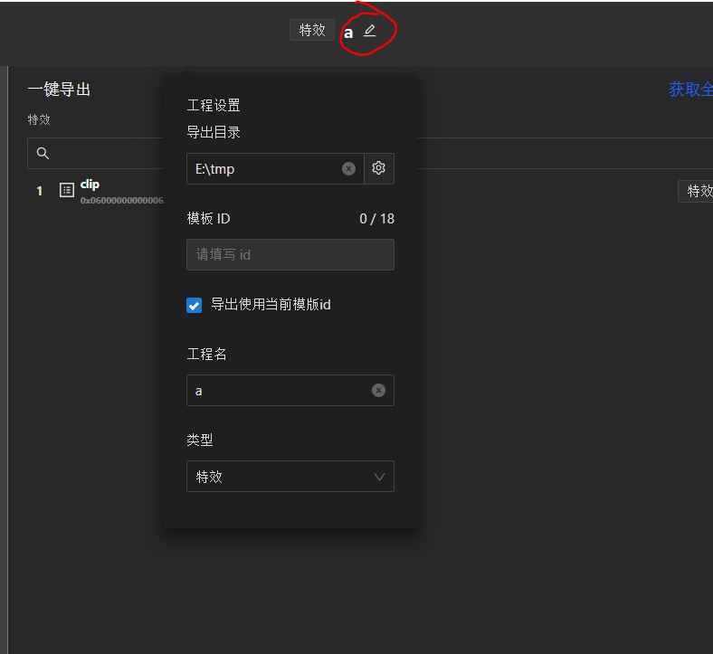
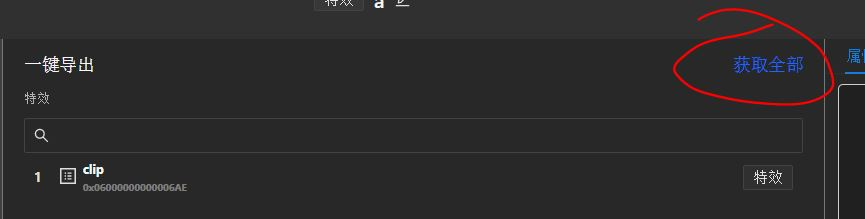

## 导出工具
1. 图片、视频先打成预合成, 在预合成上加特效.

2. 选择`一键导出`下的合成, 将其设置为用户源

3. 编辑工程名称

4. 获取`id`

## testbed

* `特效06`类型模板, testbed选择`AnimationEffect`.

* `04`模板, 选择`imageEffect`.

实现细节:
`CQVETDistributeOutputStream`类, 进行分发

其他参考: [Win32 TestBed配置](https://quvideo.feishu.cn/wiki/wikcnpvKlNRgoA3qJnXO8rUkHoe#K6M4mM)

## Android 小影配置
参考: [App开发环境配置（Android）](https://quvideo.feishu.cn/wiki/wikcnDXQUPxGoyfpcRb4izMK90e)
