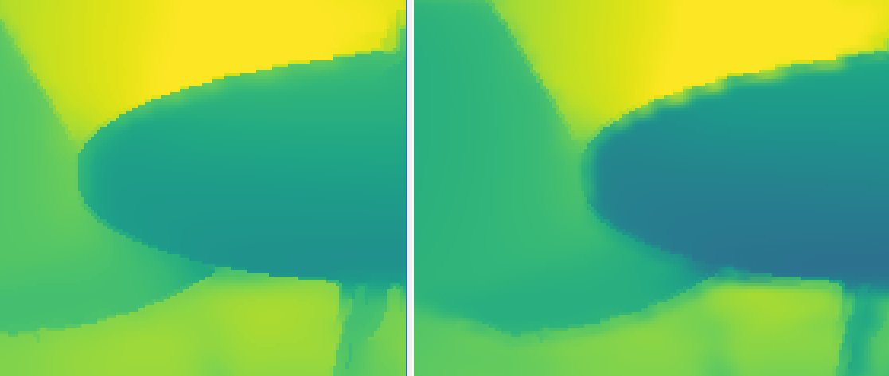
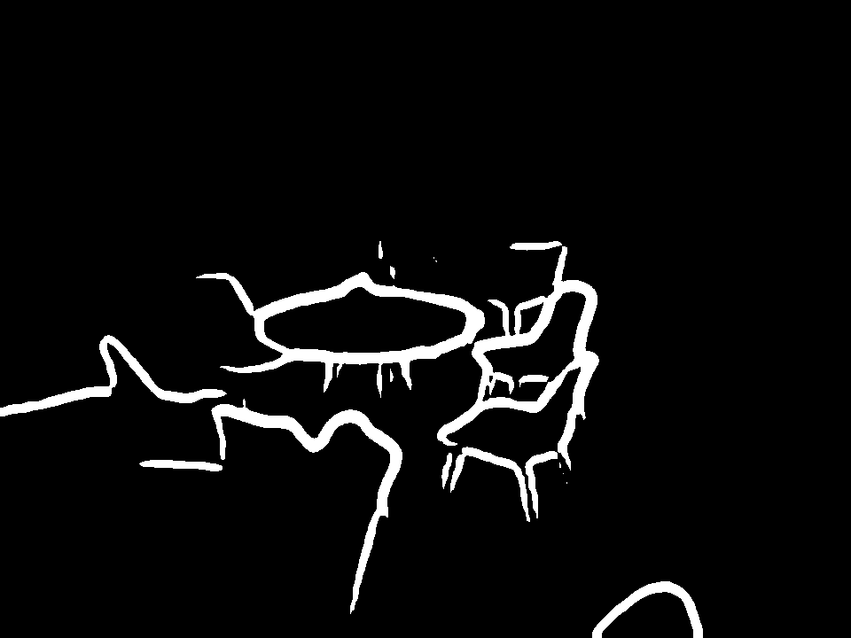
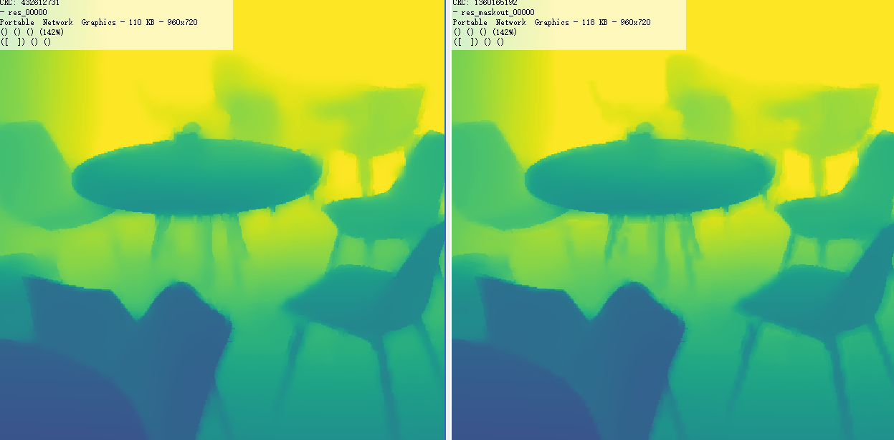
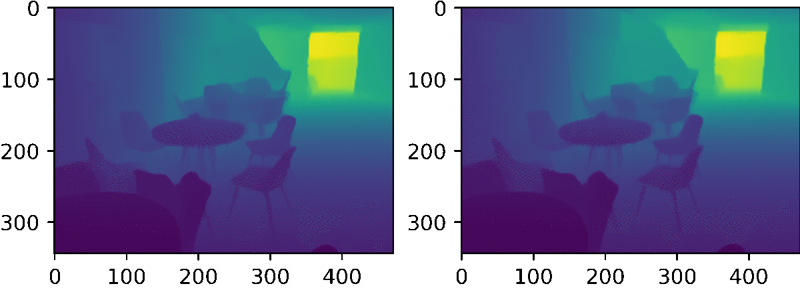

## 总体进度
### 文字相关
- [x] 文字效果接入
    接入decode得到的深度纹理, 设置文字深度, 实现遮挡效果.
    UpdateFrameBuffer()函数中获取当前深度, 并设置给textRender.
    textRender中对于深度值大于某个值的fragment discard掉即可.

- [ ] 单字底图bug解决

- [ ] 文字带深度的code update
- [ ] 文字带深度渲染时使用Metal崩溃问题

### iOS Lidar
- [ ] libqvar
    - [ ] 支持双摄
    - [x] 支持错误码返回

- [x] rendering engine更新

- [x] 方案测试
    - [x] 将solver的方式转化为filter的方式, 在GPU上实现.
        使用filter的方式需要较大的滤波半径, 且效果与solver相比差很多.
        <figure class="image">
        
        <em>
solver(左)和filter(右)结果对比
</em>
        </figure>
    
    - [x] 减少待优化量
        事实上我们仅需要对深度图的edge区域进行深度优化(抗锯齿)
        <figure class="image">
        
        
        <em>
深度图边界(上). solver完整结果(左下)和只优化深度图边界(右下)的对比
</em>
        </figure>
    
    - [x] 利用光流跟踪, 构建时序约束来减少深度图闪烁
        <figure class="image">
        
        <em>
原深度图(左)与去闪烁之后的深度图(右)
</em>
        </figure>
        

- [ ] 算法移植
    - [x] 使用Metal Performance Shader内置Filter计算中间数据
        - [x] MPSImageCanny、MPSImageScale
        - [x] 利用其余的Filter入MPSImageSobel 计算既符合color image又符合depth image的edge
        - [ ] 构建方程使用共轭梯度法求解
        - [ ] 测试系统的光流跟踪
        - [ ] 利用光流跟踪加入时序平滑项
    - [ ] 性能测试, 探索该形式的稀疏矩阵的快速求逆方法

- [ ] 代码合并
    - [ ] 合并代码
    - [ ] 测试

- [ ] 深度图预览的colormap

## Daily Work Log
* 2021.1.27
    - [x] 文字字间距问题测试, 推动模版以及app代码修改修改
* 2021.1.28
    - [ ] 获取MPSImage的结果数据, 完成swift调用c++代码
    - [ ] trunk depth代码合并
    - [ ] 单字底图bug修复
        - [x] Xiaoying app compile pass & 字幕模版测试下载正常
        - [x] 换行后不正常问题
        - [ ] 对于单字底图固定字间距
    - [ ] 面试x2